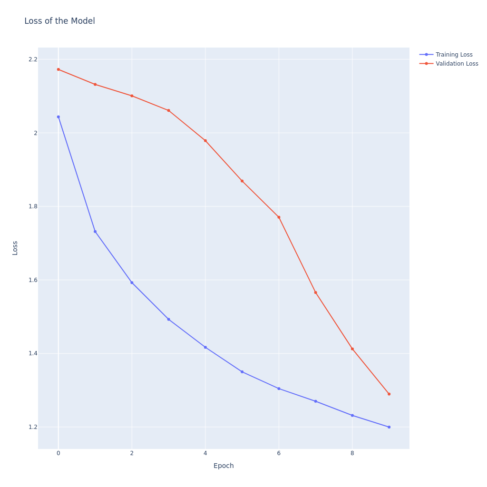

# visual-analytics-assignmen3
Third Assignment for Visual Analytics in Cultural Data Science.

This repository contains code for training a classifier with Keras on the [Tobacco3482](https://www.kaggle.com/datasets/patrickaudriaz/tobacco3482jpg?resource=download)
dataset using pretrained image embeddings from the VGG16 model.

## Usage

### Data

You should download the data from this [Kaggle page](https://www.kaggle.com/datasets/patrickaudriaz/tobacco3482jpg?resource=download).
Put the archive in a `dat/` folder in the repository's folder.

You should then unzip the archive.

```bash
cd dat/
unzip archive.zip
```

### Requirements

```bash
pip install -r requirements.txt
```

### Training

Run the `src/train.py` script to train the model.

```bash
python3 src/train.py
```

This will output a `loss_curve.png` and a `classification_report.txt` into the `./out/` directory.

## Methodology

### Preprocessing

All images were resized to have maximal width and height of 224 pixels, and were padded with black pixels to achieve the desired `224x224` size.
One-hot encodings were produced for the labels.

The dataset was split into training (60%), validation (20%) and test (20%) sets.
The number of examples of each class was equalized across splits.

### Training

Image embeddings were extracted using the VGG16 model.
A classifier was trained with one hidden dense layer with ReLU activation aided with batch normalization and dropout.
An Adam optimizer was used with learning rate of `1e-3`.
The model was trained for 10 epochs with batches of 32 examples.

## Results

### Loss curve



The loss curve indicates that the model should have been trained for more epochs, as the model's validation loss was decreasing roughly at the same pace as the training loss,
and when training was terminated both of them still had a negative trend.
This indicates that the model's knowledge, which it was still in the process of learning, was generalizable to unseen images.

### Classification Report

|          | precision | recall | f1-score | support |
|----------|-----------|--------|----------|---------|
| ADVE     | 0.85      | 0.89   | 0.87     | 46      |
| Email    | 0.75      | 0.84   | 0.79     | 120     |
| Form     | 0.53      | 0.79   | 0.63     | 86      |
| Letter   | 0.60      | 0.77   | 0.68     | 114     |
| Memo     | 0.54      | 0.55   | 0.54     | 124     |
| News     | 0.76      | 0.58   | 0.66     | 38      |
| Note     | 0.71      | 0.12   | 0.21     | 40      |
| Report   | 0.58      | 0.36   | 0.44     | 53      |
| Resume   | 0.86      | 0.25   | 0.39     | 24      |
| Scientific | 0.57     | 0.40   | 0.47     | 52      |
| Accuracy |           |        | 0.63     | 697     |
| Macro avg| 0.67      | 0.56   | 0.57     | 697     |
| Weighted avg | 0.64  | 0.63   | 0.61     | 697     |

The model's performance on the holdout set was way above chance level, indicating that its knowledge is solid and generalizable.
Performance was not equally good across all classes, it would seem that the model had trouble recognizing certain types of documents.
Resumes and Notes for instance had very low F1 scores, mostly dragged down by very low recall, meaning that many of these got recognized as something else (high number of false negatives).
On the other hand, there were a low number of false positives when predicting these two classes, indicated by high precision.

While the dataset was fairly imbalanced, the model did not seem to learn frequent classes substantially better than infrequent ones.
ADVE documents were for example rather uncommon, but we still achieved an F1 score of 0.87, while there were many examples of Memos, and the model was not particularly good at recognizing these, indicated by an F1 score of 0.54.
